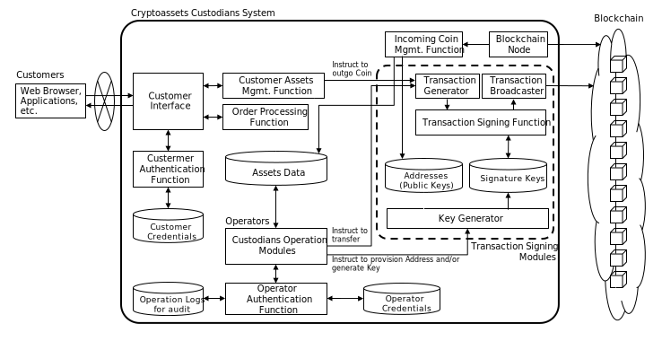

---
title: General Security Considerations for Crypto Assets Exchange
abbrev: General Security Considerations for Crypto Assets Exchange
docname: draft-vcgtf-crypto-assets-security-considerations-latest
category: info
date: {DATE}

ipr: trust200902
area: General
workgroup:
keyword: Internet-Draft

stand_alone: yes
pi: [toc, sortrefs, symrefs]

author:
 -
    ins: M. Sato
    name: Masashi Sato
    organization: "SECOM Co., Ltd. Intelligent System Laboratory"
    abbrev: "SECOM IS Lab."
    street:
    - SECOM SC Center
    - 8-10-16 Shimorenjaku
    city: Mitaka, Tokyo
    code: '181-8528'
    country: JAPAN
    email: satomasa756@gmail.com
 -
    ins: M. Shimaoka
    name: Masaki Shimaoka
    organization: "SECOM Co., Ltd. Intelligent System Laboratory"
    abbrev: "SECOM IS Lab."
    street:
    - SECOM SC Center
    - 8-10-16 Shimorenjaku
    city: Mitaka, Tokyo
    code: '181-8528'
    country: JAPAN
    email: m-shimaoka@secom.co.jp
 -
    role: editor
    ins: H. Nakajima
    name: Hirotaka Nakajima
    organization: Mercari, Inc. R4D
    abbrev: Mercari R4D
    street:
    - Roppongi Hills Mori Tower 18F
    - 6-10-1 Roppongi
    city: Minato, Tokyo
    code: '106-6118'
    country: JAPAN
    email: nunnun@mercari.com

normative:
  RFC2119:

informative:

--- abstract

<!-- この文書は仮想通貨交換所の事業者が利用者の資産を保護する目的としてセキュリティを検討するための推奨事項を整理するものである。保護すべき資産のうち、特に仮想通貨の秘密鍵は従来の情報システムとは異なる特徴があり留意が必要である。仮想通貨交換事業者が秘密鍵を適切に管理し、顧客が意図しない不正な取引を防止するために留意すべき点を特に重点的に述べる。 -->

This document discusses the threat, risk, and controls on the followings;
Online system of crypto assets exchange that provides the exchange service to its customer (consumers and trade partners);
asset information (including the private key of the crypto assets) that the online system of a crypto assets exchange manages;
Social impact that can arise from the discrepancy in the security measures that are implemented in the online system of a crypto assets exchange.

This document is applicable to the crypto assets exchanges that manages the private key that corresponds to crypto assets. It includes the organizations that outsources the key management to another organization. In such a case, the certain recommendations applies to those outsourcers.

--- middle

# Introduction

TBD

# Scope of this document

<!-- 本書が対象とする事業者は、仮想通貨の秘密鍵を保有する仮想通貨交換所の事業者である。秘密鍵の管理を他の事業者へ委託する場合も含む。その場合、秘密鍵の管理を委託された事業者についても、本書が示す推奨事項の相当箇所が適用されるものと考える。
本書は以下の対象に対する脅威やリスクに関する考察を含む。
顧客（消費者や取引相手）に対して仮想通貨の交換業務を提供する仮想通貨交換所オンラインシステム
仮想通貨交換所オンラインシステムが管理する資産情報（仮想通貨の秘密鍵を含む）
仮想通貨交換所オンラインシステムのセキュリティ対策の不備により及ぼしうる社会的な影響
本書で対象とする仮想通貨交換所オンラインシステムの基本モデルは5章で示す。この基本モデルとは別の形態のシステム、例えば、利用者が提示する秘密鍵を事業者が管理する業態（例：オンラインウォレット）等については別の補完的な文書あるいは本書の後の改訂で扱うものとする。
本書は以下についてはスコープ外とする。
仮想通貨の仕組みを提供するブロックチェーンや分散台帳自体に対するセキュリティ対策
事業者自身の経営リスク
顧客と交換所の資産の分離に関する具体的な要件 -->

This document discusses the threat, risk, and controls on the followings:
* Online system of crypto assets exchange that provides the exchange service to its customer (consumers and trade partners);
* Asset information (including the private key of the crypto assets) that the online system of a crypto assets exchange manages;
* Social impact that can arise from the discrepancy in the security measures that are implemented in the online system of a crypto assets exchange.

This document is applicable to the crypto assets exchanges that manages the private key that corresponds to the crypto assets. It includes the organizations that outsources the key management to another organization. In such a case, the certain recommendations applies to those outsourcers.

# Conventions and Definitions

The key words "MUST", "MUST NOT", "REQUIRED", "SHALL", "SHALL NOT", "SHOULD",
"SHOULD NOT", "RECOMMENDED", "NOT RECOMMENDED", "MAY", and "OPTIONAL" in this
document are to be interpreted as described in BCP 14 {{RFC2119}} {{!RFC8174}}
when, and only when, they appear in all capitals, as shown here.

# Terminology

Terms used in this document are defined in other i-d.

# Basic description of a model online system of a crypto assets exchange

## General

In this section, a model online system of a crypto assets exchange that is used to explain the concepts and provisions in this document are explained.

## A basic model of online system of a crypto assets exchange and its functional components

Followings are the basic model of a crypto assets exchange that this document deals with.

<!--  -->

## The flow leading to the sending of the transaction

## Types of keys that are used for signature and encryption

### Type of keys

|Types | Description |
| ---  | --- |
|Signature Key | A private key for signing transactions (asymmetric key cryptography) |
|Verification Key | A public key for verification of transactions (asymmetric key cryptography Recipient address of transactions are unique value calculated from verification key |
| Encryption/decryption key for signature key | Secret key to keep confidentiality of signature key (symmetric key cryptography) |
|Master Seed | A seed to generate a signature key in decisional wallet |

### Flow for the key generation and the key usage

Fig. 5-2 Lifecycle of signature key, verification key and encryption/decryption key for signature key

After a pair of a signature key and a verification key (hereafter “key pair”) is generated, an address to receive transactions is generated from the verification key. By notifying a sender of digital asset this address, the sender is able to transfer the asset to the address. When the recipient transfers the asset to the other address, the original recipient signs the transaction data which includes the transfer order.
Inactive state of the signature key is the state such that the signature key is stored in confidential manner in the signature key management function of fIg.1. An example of inactivation is encryption by encryption/decryption key (e.g. pass phrase), that is,  the signature key is encrypted. In contrary, activation is the process to make the key usable to sign, by decrypting the inactivated key. The activation is assumed to be executed in transaction signing function if fig.1. Activation and inactivation may be executed in an implementation of wallet, when the wallet have both functions. The signature key is not needed after its generation until execution of signing to transaction. Thus, there is a way to manage the signature key in offline manner with storing the verification key and address online (see 9.2.2).

### On the usage of multiple keys

In some digital asset system, it is recommended not to use the same key pair twice, thus it produces multiple key pairs. This feature is for preventing trace and not relevant to the business efficiency of a digital asset custodian. However, a digital asset custodian should manage addresses for each customer. Thus it should manage multiple key pairs for the same digital asset.

### On the suspension of keys

Suspension of key usage is only an operation inside a digital asset custodian. By definition of blockchain based digital asset system, any user cannot cancel transaction once it is made. As another case, it is difficult to revoke signature key even after the suspension of key. For example, a customer accidentally operate some digital asset for suspended address. In such case, the suspended signature key is needed to make an reimbursement. Thus, suspension of keys should be conducted with considering such
cases.

## On the characteristics of crypto assets on Blockchain and distributed ledger technologies

In this sub-clause, following items will described as characteristics of digital assets over blockchain and distributed ledger technology in preparation for section 8 and 9.

### The importance of the private key used for signing

### Diversity of implementations

#### On the cryptographic algorithms used by crypto assets

#### On the possibility of the forking of the Blockchain

#### Rollback by reorganization

#### The treatment of the forked crypto assets

### Risk on the unapproved transactions

#### General

#### The handling of the unapproved transactions

#### Transaction failures caused by the vulnerabilities of the implementation or the specification of the crypto assets

# Basic objectives for the security management of digital asset custodians

At digital asset custodians, it is mandatory to establish, conduct, maintain and continuously improve security management.
As requirements in term os security management, items described in ISO/IEC 27001:2013 are sufficiently
considered according to the business process of
each digital asset custodian. Especially, following items should be carefully considered, because a digital
asset custodian retains customer's asset and should deal with issues specific to
digital assets.

- On stakeholders (Related to ISO/IEC 27001:3013 Clause 4)

It is needed to consider protection of customer's assets, as well as
division of responsibility with outsourcee including security of private key management for crypto asset, and mattes by which
a digital asset custodian may give social impacts like money laundering.

- On security policy (Related to ISO/IEC 27001:2013 Clause 5)

A digital asset custodian should define a security policy which includes security objectives
and controls described in and after clause 7. Especially, it is recommended to disclose
the security policy on the management of digital asset to customers to facilitate self evaluation.

- Continuous risk evaluation and improvement (Related to ISO/IEC 27002:2014 Clause 6, 8, 9 and 10)

A digital asset custodian should watch security risks of digital assets in addition to aligning
the general security management framework, because the risks change and increase due to rapid development of
related technology as described in clause 5.3.2. It is especially important to continuously evaluate risk and improve
security objectives, policy and controls to keep effectiveness of security controls after starting their operations.

# Approaches to basic security controls

A digital asset custodian should decide security objectives and controls with considering all of following
viewpoints.

- Countermeasure to threat as lost, theft, leak and abuse of customer's assets data and private key for digital assets
- Requirements for actual business
- Compliance to laws and rules
- Social responsibilities to prevent crimes in use of digital assets like scam and money laundering

The digital asset custodian conducts threat analysis, vulnerability evaluation, risk evaluation and
defining security objectives and controls according to its actual business and system.
Security objectives and controls should be decided with considering threats and risks specific to
digital assets described in clause 5, as well as general security objectives and controls
described in ISO/IEC 27002:2013.

Followings are items of security objectives and controls described in ISO/IEC 27002:2013.

- Information Security Policies
- Organization of information security
- Human resource security
- Asset management
- Access control
- Cryptography
- Physical and environmental security
- Operations security
- Communications security
- System acquisition, development and maintenance
- Supplier relationships
- Information security incident management
- Information security aspects of business continuity management
- Compliance

Consideration of above items is mandatory. Next close describes specific items to be considered by a digital asset custodian.

# Risks of Crypto Asset Exchange

## General

The main risks to be noted as a Crypto Asset exchange office are roughly classified into those related to the system of the Crypto Asset exchange office, those caused by external factors such as a block chain outside the control of the Crypto Asset exchange office, and risks leading to abuse such as criminal acts Enumerate. Risks related to the system of the Crypto Asset exchanges are organized in terms of threats and factors, actors that pose a threat. Organize in terms of possible incidents in risks caused by external factors such as block chains and risks of misuse. There may also be risks inherent in systems and operations that are different for each operator. Each business operator needs to identify the risks to be dealt with while taking into consideration the risks shown in this section, taking into consideration different systems and operations for each business operator. After that, it is desirable to determine the priority of the control measures by evaluating the impact each risk can have on the business.

## Risks related to the system of the Crypto Asset exchange

Here are the typical risks to the information assets held by the system of the Crypto Asset exchange.
In the basic model of Section 5.2, pay attention to the signing secret key and the asset data as an information asset which is particularly important from the viewpoint of protecting customer assets.
If the signing secret key and the surrounding environment are not secure, it is also possible for a malicious person to create an illegal transaction and send it to the node in the block chain. Once an illegal transaction is sent to the node and written to the block chain it is nearly impossible to cancel the transaction. Therefore, prior measures to prevent illegal transactions being created are particularly important. It is necessary to carefully evaluate the risks related to management of signing secret keys and illegal transaction creation and to consider appropriate safety measures. In addition, it is necessary to consider the loss of the signing secret key. When the signing secret key is lost, it becomes impossible to use the Crypto Asset stored in the address corresponding to the signing private key. As for the risk concerning the signing secret key, consider the secret key for signature and the environment surrounding it based on the basic model in Section 5.2 in Section 8.2.1.
As for the asset data, since the contents of data, data format, management form, and details of processing vary from exchanges to exchanges, this document considers the model more abstracted. Common contents of asset data to be protected include the total amount of Crypto Asset and legal currency deposited by the customer at the exchanges, the amount of Crypto Asset and legal currency held by the exchanges, customer account number and Crypto Asset An address and so on are conceivable. If such asset data is illegally rewritten by a malicious one, it will also cause damage to customers and impede the work of the exchanges. The asset data is discussed in section 8.2.2.
In addition to protecting important information such as transaction signature private key and asset data, it is also necessary to consider risks such as system outage so that customers can smoothly control their own assets. Risks related to system outages are discussed in Section 8.2.3.
In addition to the information and risks mentioned in this section, there are risks inherent to each system of the Crypto Asset exchange and risks in cooperation with external business operators. It is necessary to conduct a detailed risk assessment on the actual system of the Crypto Asset exchange.

### Risks related to signing keys

In the Crypto Asset exchange, the role and risk of the signing key are extremely large. This is not only to enable the transfer of coins but also to disappear due to the anonymity of the Crypto Asset, the property that it is impossible to revocation the signing key against leakage / theft or roll back the transaction by. In this section, we show the risk of fraudulent use that could lead to the loss of the signing key, leakage / theft, and damage of value. It also shows supply chain risk etc. when introducing Wallet related to signature key.

#### Risk analysis of signing secret key

Risk analysis differs depending on the assumed threats, system configuration, threat modeling, and so on. In this section, we show a case study based on the following assumption as an example.
Here, the threat concerning the signature secret key and the factors that can cause the threat are assumed as follows. In addition, we assumed the following as the actor giving input to the signing secret key based on Figure 5-1 in Chapter 5.

* Threats:
  - lost
  - leakage, theft
  - fraudulent use

* Factors of Threats:
  - misoperations
  - Legitimate users’ malice
  - Spoofing
  - Intrusions from outside
  - Unintended Behaivors of implementations

* Actors:
  - exchange operation modules
  - Transaction Signing modules
  - customer asset management function implementation
  - incoming coin management function implementation

Factors of threats are organized as follows.

Misoperation: An act that an authorized user (including an administrator) of the system accidentally operated by mistake. For example, it is incorrectly supposed that an operation to coin 100,000 yen is incorrectly dispatched for 1 million yen.

Legitimate users’ malice: Acts performed by a legitimate user of the system (including administrator etc) with malicious intent. For example, theft or unauthorized use of the signature private key due to internal fraud. In this case, it is the purpose of identifying acts that can be factors, and the purpose and incentive of the act are not limited here.

Spoofing: An act other than an authorized user of the system impersonating a legitimate user (more accurately impersonating some kind of operation). For example, an internal burglar without administrator privilege accesses the system with administrator authority.

Intrusions from outside: an act of an outsider accessing the system maliciously in a manner other than spoofing. For example, by using malicious intrusion from the outside by exploiting the system's vulnerability, incorporating malware into the exchanging system via targeted e-mail to the exchanges administrator or the like and generating a private signature private key (or transaction creation) from the outside, Allow remote control of etc.

Unintended Behaivors of implementations: The system behaves unexpectedly by the designer or operator irrespective of the intention or malice of the operation. For example, a signature private key leaks due to a bug in the exchange management system.

Of these threat factors, theft and fraudulent use are regarded as threats that can only be caused by explicit malicious factors. As a result, the possible risks for signing key to be assumed are the following:

a) Threat by lost
- Risk of Unauthorized operation (with legitimate path)
    - End-user's malice
    - Operator's malice in Custodian
    - Spoofing to end users
    - internal frauds (spoofing to operators)
- Risk of Intrusion from the outside
    - Intrusion into the transaction signing modules
    - Intrusion into the incoming coin management function (implementation)
    - Intrusion into the customer asset management function (implementation)
    - Intrusion into the exchange operation modules
- Risk of System Behaviors different from human operation
    - Unintended behaviors of the transaction signing modules
    - Unintended behaviors of the incoming coin management function (implementation)
    - Unintended behaviors of the customer asset management function  (implementation)
    - Unintended behaviors of the exchange operation modules
- Risk of misoperation (by human error)
    - Misoperation of end user
    - Misoperation of operator

b) Threat by leakage
- Risk of Unauthorized operation (with legitimate path)
    - End-user's malice
    - Operator's malice in Custodian
    - Spoofing to end users
    - internal frauds (spoofing to operators)
- Risk of Intrusion from the outside
    - Intrusion into the transaction signing modules
    - Intrusion into the incoming coin management function (implementation)
    - Intrusion into the customer asset management function (implementation)
    - Intrusion into the exchange operation modules
- Risk of System Behaviors different from human operation
    - Unintended behaviors of the transaction signing modules
    - Unintended behaviors of the incoming coin management function (implementation)
    - Unintended behaviors of the customer asset management function  (implementation)
    - Unintended behaviors of the exchange operation modules
- Risk of misoperation (by human error)
    - Misoperation of end user
    - Misoperation of operator

c) Threat by theft
- Risk of Unauthorized operation (with legitimate path)
    - End-user's malice
    - Operator's malice in Custodian
    - Spoofing to end users
    - internal frauds (spoofing to operators)
- Risk of Intrusion from the outside
    - Intrusion into the transaction signing modules
    - Intrusion into the incoming coin management function (implementation)
    - Intrusion into the customer asset management function (implementation)
    - Intrusion into the exchange operation modules

d) Threat by fraudulent use
- Risk of Unauthorized operation (with legitimate path)
    - End-user's malice
    - Operator's malice in Custodian
    - Spoofing to end users
    - internal frauds (spoofing to operators)
- Risk of Intrusion from the outside
    - Intrusion into the transaction signing modules
    - Intrusion into the incoming coin management function (implementation)
    - Intrusion into the customer asset management function (implementation)
    - Intrusion into the exchange operation modules

The following sections outline each risk, and their security controls are shown in Section 9.2.2.

#### Risk of loss of signing secret key

The disappearance risk shown in Table 8-2 is an enumeration of events having a possibility of causing disappearance, paying attention to the input (operation instruction) to the signature secret key.
As a typical risk, loss of the secret key for signature due to erroneous operation by the administrator may be considered.

#### Leakage / theft risk of signing private key

Intentional operation by malicious intention is essential, but leakage can be caused by negligence without malice. For this reason, leakage risk and theft risk need to be sorted out.

The leakage risk shown in Table 8-2 lists events that have the possibility of causing leakage including negligence, paying attention to the input (operation instruction) to the signing secret key. Typically, an internal criminal, leakage risk due to unintentional behavior, illegal invasion, etc. can be considered.
Likewise, the theft risk enumerates events that have the possibility of being woken up by some sort of malicious intention, paying attention to the input (operation instruction) to the signature secret key. Typically, there is a risk of leakage from internal criminals or unauthorized intrusion from the outside.

Both leaks and theft are similar in terms of leakage of sensitive information to the outside, and the control measures are common. This will be described later in Section 9.3.2.

#### Risk of unauthorized use of signing private key
The fraudulent use risk shown in Table 8-2 is an enumeration of events having a possibility of being caused by something with a malicious intention, paying attention to the input (operation instruction) to the signature secret key. Typically, there is a risk of illegal use due to illegal invasion or impersonation from the outside.

#### Other related risks

Supply chain risk of hardware wallet
As a product having a secret key management function, there is a so-called hardware wallet. Many hardware wallets connect to the management terminal such as PC via USB and perform key management operation from the management terminal. FIPS 140-2, etc. as a security certification of products with key management function, etc. However, since most of cryptographic algorithms handled by Crypto Asset are not subject to certification, the security of hardware wallet for Crypto Asset Unfortunately it is inevitable that the third-party accreditation system on insurance is inadequate. For this reason, while there are products with sufficient safety in the hardware wallet that circulates in Ichii, it is necessary to recognize that there are products with insufficient safety.
Furthermore, even with products with certain safety, safety may be impaired by being crafted on the distribution route. For example, a hardware wallet that is loaded with malware in the middle of a sales channel, even if the purchaser newly generates a signing secret key in the hardware wallet, the attacker can use the signature secret It becomes possible to restore the key.

### Risks related to asset data

The asset data is data for managing assets such as Crypto Asset and statutory currency held by customers and exchanges. The secret key of the transaction signature shall not be included (see section 5.2).
As mentioned above, since asset data varies from exchanges to exchanges, we consider this as a more abstracted model in this document. Since detailed threat analysis and risk assessment need to be performed on the asset data handled by the actual exchange system, only the way of thinking is shown here.
The main threats of asset data may be illegal rewriting, loss, or leakage. The factors include misoperation by the manager, malice of the righteous person, spoofing the legitimate person, malicious intent of the outsider, unintended behavior of the system. In the example of the basic model in Section 5.2, there is a route from the exchange management system, the customer property management system, and the incoming coin determination unit.
Among the threats of asset data, the following examples are considered as incidents due to illegal rewriting.
A customer asset management system referring to unauthorized asset data may create an illegal transaction and flow through the normal process to the block chain (Section 8.2.1.4). For example, it is possible to rewrite the holding amount recorded in the asset data, change the Crypto Asset transfer destination address, or the like.
For example, by rewriting the list of addresses associated with the customer, illegal recombination of the amount held between customers or between customers and exchanges within the asset data within the exchange will be made. As a transaction in the block chain the result is not reflected, assets that a customer or exchange should have had is lost.
Risks related to asset data can be thought of as a problem similar to general financial and settlement systems, but transactions can be canceled if transactions are written to the block chain as a result of fraud against asset data It is necessary to consider it on the premise that there is no property.

### Risks related to suspension of systems and operations

The system of the virtual currency exchange office is software, hardware, network, and the like constituting the virtual currency exchange. In addition, the term "operation" refers to an operation performed manually, such as operation monitoring of a switching center system, account opening, remittance instruction, wallet deposit / withdrawal. It is conceivable that the system and work may be stopped due to various factors.
Risks related to suspension of systems and operations can be regarded as problems similar to general financial and payment systems. However, the fact that the virtual currency exchange office is connected to the Internet all the time, not the dedicated communication network at all times, that it is operating 24 hours a day, 365 days, that many virtual currency exchanges are built on the public cloud infrastructure, virtual currency exchange It is necessary to consider it based on the fact that the operating situation of the place has a large effect on the virtual currency price and it tends to be an object of attack.

#### Risks related to network congestion

Virtual currency exchanges frequently receive denial of service attacks. As a target of a denial-of-service attack, publicly-released top page, API endpoint, etc. are common, but when an attacker knows the system configuration and a business system or operation monitoring system is placed on the Internet, A case of receiving a denial of service attack may be considered.

#### Risk of system outage

It is conceivable that the data center, the cloud infrastructure, etc. where the system is installed are stopped, and the system and operations are stopped. The system can be stopped due to various factors such as power outage due to natural disasters and disruption of communication, large scale failure due to mistake by cloud infrastructure operator, large scale system failure due to mistake of infrastructure operation, failure of software release.

#### Risks related to Operator

Even if the system itself is in operation, if operations monitoring and tasks of personnel responsible for the operation are hindered, the work will be suspended. For example, regular inspections of power facilities at operation bases, disruption of transportation means due to catastrophic changes and strikes, protest activities and rush of press reporters may hinder the entrance and exit of buildings and halt operations.
In addition, when personnel are using the same transportation method or participating in the same event, there is a risk that many personnel can not operate due to the same accident such as traffic accident or food poisoning.

#### Regulatory risks

In countries where the virtual currency exchange office is stipulated, licensing system or registration system, business may be suspended due to business improvement order, business suspension order, deletion of registration etc etc.

## Risks from external factors

Even if the systems and operations of the virtual currency exchange are appropriately operated, if the blockchain / network in which the virtual currency operates and the Internet infrastructure supporting the connection between the nodes are attacked, On the other hand, the service cannot be continued or the transaction can not be handled properly.

### Risks related to the Internet infrastructure and authentication infrastructure

#### Internet routing and name resolution attacks

An attacker interferes with routing of the Internet such as route hijacking and domain name resolution (Domain Name Service), hindering the reachability to the exchanges and guiding it to a fake exchange office or block chain It is possible to intentionally cause a branch by hindering synchronization. This method can be considered not only by malicious attackers but also by ISP etc. based on instructions from the government.

#### Attacks on Web PKI

Many virtual currency exchange offices provide services on the Web, and TLS and server certificates are used for user authenticity verification and encryption of sites. When a certificate authority issuing a server certificate is attacked, it may be possible to impersonate the site, or if the server certificate is revoked, the service cannot be provided.

#### Attack on Messaging

By intervening with an e-mail or other messaging system, an attacker can fraud and block SMS / MMS of e-mails and mobile phones used for interaction with users and delivery of one-time passwords. When a user's message is fraudulent, it is possible to log in as a user and reset the password.

### Troubles due to block chains of virtual currency

#### Virtual currency blockchain fork, split

#### Re-org of Blockchain by 51% attack and selfish mining

#### Compromise of hash function and cryptographic algorithm

#### Inadequate consensus algorithm

By misusing a bug in the agreement algorithm, fake transaction information is sent to a specific node and disguised as to whether or not to send money to the counterparty. For example, in the case of the MtGOX case in 2014, double payment attacks abusing Transaction Malleability occurred frequently in piggybacking.

### Risks arising from external reputation databases

#### Establishment of Bank Account Elimination and Freezing

As a part of AML / CFT, there are cases where banks refuse to open accounts related to the work of the virtual currency exchange office, the risk that the bank accounts will be frozen, such as receiving guidance from the regulatory authorities or accident is there. In the event that the account is frozen, the business of depositing and withdrawing a legal currency with the user as a virtual currency exchange office is stopped.

#### Virtual currency address

As a part of AML/CFT, when another virtual currency exchange trader remittles to another virtual currency address, there are cases where it is checked whether the remittance destination address does not correspond to a high risk transaction. In the case where the address of the hot wallet of the exchange office is registered as a problematic address, it is assumed that the exchange of the virtual currency with such a service can not be performed smoothly. Since it is common in many cases that criminal remit virtual currency stolen for disturbance to a known address, there is a risk that the address of the hot wallet of the virtual currency exchange office will be classified as a high risk customer by mistake.

#### Filtering and blocking for Web sites

There is a risk that the URL of the virtual currency exchange office is filtered by the network or blocked by the ISP so that the user can not access it. Also, if it is recognized as a malware distribution site or the like, there is a risk that it will not be displayed as a search result or it will be impossible to browse from the browser.

#### Email

As a measure against spam mails, most of mail servers provide mail rejection based on reputation and classification function of spam mails. If the e-mail delivered by the exchange is judged as spam, it may be impossible to contact the user.

#### Appraisal of a smartphone application

Depending on the platform, there are cases where handling of virtual currency by the application is restricted. If the examination of the smartphone application is dropped, the user may not be able to download the smartphone application for accessing the exchange and may be unable to use the service.

## Financial Crime Risks

### Risk of being abused in criminal acts

#### Identity Theft

#### Scams

#### Ransom

#### Utilization for transactions in the dark market

### Anti Money Laundering

### Counter Financing of Terrorism

# Consideration on security controls at digital asset custodian

## General

In this clause, considerations from the ISMS viewpoint in implementing security controls to digital asset custodians for risks described in clause 8 are described.
They included issues caused by specific characteristics to digital asset. This clause also describes relationship to ISO/IEC 27001:2013 and ISO/IEC 27002:2013 for each consideration.

## Consideration on security controls
### Direction of the information security management

Objectives of security management at a digital asset custodian contain secure protection of customer's asset, compliance to business requirements, laws and rules, and realization of social responsibility. Security policies and execution statements derived from such objectives are recommended to be publicly available for consumers, business partners, auditor and regulators to help their judge.

### Security controls on signing keys

#### Basics of key management

In general, followings are required in management of private cryptographic keys.

- They should be Isolated from other informational assets. Rigorous access control is mandatory.  
- Limit the number of access to private keys as minimum as possible.
- Be prepared for unintentional lost of private keys.

Followings are three basic security control to realize above. Additional security controls specific to digital asset custodians are described in and after sub-clause 9.2.2.2.

1) State management of private keys
 As described in figure 5-2, a private key has one of multiple states, and it may be active or inactive state in its operation. The private key should be in active state when it is used for signing or decryption. It is recommended to enforce to input some secret information to activate an inactive private key. This makes keep the inactive private key away from abuse, if the adversary does not have the secret information. This method ensure security of the private key against leakage and lost.
 It is also recommended to minimize the term of activation to limit the risk of abuse as minimum as possible. Unnecessary activation of secret key increases the risk of abuse, leakage and theft, though keeping the activation state is efficient from business viewpoint. On the other hand, frequent activation/inactivation may give impact to business efficiency. It is important to consider the trade-off between the risk and business efficiency and provide clear key management policy to customers.

2) Administrator role separation and mutual check-and-balance
It is fundamental form of operation of a critical business process which uses private key to perform cryptographic operations by multiple party to prevent internal frauds and errors. For example, by setting isolated rights on digitally signing and approval to go into the area of signing operation, it becomes difficult for single adversary to give an malicious digital signature without known by the third party. Additionally, the enforcement of attendance of other person is effective security control to internal frauds and misoperations.

3) Backup of private key
  Lost of private key makes signing operations by using the key impossible any more. Thus backup of private key is an important security control. On the other hand, risks of leakage and theft of backup keys shoube be considerd. It is needed to inactivate the backup key.

#### Buck up

Backup is the most fundamental and effective measure against lost of signing key. On the other hand, there are  risks of leakage and lost of backup device. These risks depend on the kind backup device, thus security controls on such devices should be considered independently. Followings describe typical backup devices and leakage/theft risks associated with them.

- Cloning to tamper-resistant cryptographic key management device

If a signing key is managed by a tamper-resistant key management device (device X) and X has cloning function, cloning the key to another device Y is the most secure way to backup the key, where the cloning function is the technique to copy the key with keeping confidentiality to other devices than X and Y. The implementation of the function is recommended to be evaluated/certified by certification program like CMVP or FIPS 140. Note that, the cryptographic algorithms supported by such tamper-resistant key management devices are limited and all digital asset systems can utilize it, but it is one of the most secure way of backup.

- Backup to storage for digital data

Here, it is assumed to backup keys to storage like USB memory and DVD. There are two types of operations; one is backup data is stored in movable devices in offline manner, the other is backup data is stored in online accessible manner. If the device is movable, the possibility of steala and lost increases, thus the device should be kept in a cabinet or a vault with key, and the access control to such cabinet/vault should be restrict.  
Of the backup storage is online, risks of leakage and theft should be assumed as same as the key management function implementation inside the digital asset custodian. In general, the same security control is recommended to such backup storage. If there is some additional operation, for example the backup device is inactivated except for the time of restore, the security control may be modified with considering operation environment. When it is not avoided the raw key data is be outside of the key management function implementation, the custodian should deal with the problem of remained magnetics.

- Backup to paper

There is a way to backup keys in offline manner, to print them to papers as a QR code or other machine readable ways. It is movable than storage for digital data and easy to identify. There remains some risk of leakage and theft by taking a photo by smartphone and so on.

#### Offline management

There is a type of offline key management (as known as "cold wallet") which isolates private keys from the system network to prevent leakage and theft caused by intrusion.

<!--  -->

In this case, some offline operation is needed to make the system use the key. Examples are, keys are usually stored inside a vault and connected to the system only when it is utilized, and USB memory is used to data transportation between an online system and an offline system.  If there is not explicit approval process in the offline operation for key usage, anyone cannot stop malicious transaction. That is, this solution can prevent lost and theft, however, an explicit approval process is needed to prevent abuse of keys.

#### Distributed management

It is also a good security control to distribute the right to use private key to multiple entity. There are two examples; division of secret key and multi-signature.

- Division of secret key　
Division of the signing key to multiple parts, then manage them by multiple isolated system is an effective measure to protect the keys against leakage and theft. This document does not recommend  a specific technique, but recommends to implement this control based on a certain level of security evaluation like secret sharing scheme. In that case, secure coding and mounting penetration test are needed to eliminate the implementation vulnerabilities. This method is also effective to backup devices.

- Multi-Signature  
This is a signature scheme which requires multiple isolated signing keys to sign a message. It is effective to protect each key hold by an entity and signing mechanisms. There are many different realization of multi-signature and they are different according to specific digital asset system. Thus, consideration on preparing multiple implementations and their interoperation is need when a digital asset custodian operate multiple digital assets.

#### Other issues

In this sub-clause, following topics will be described.

Security of wallet implementation
Monitoring of private key access
Log audit

### Security controls at digital asset custodian

Following security controls addition to kay management in sub clause 9.2.2 will be described in this sub clause.

- Organization of information security
- Category and management of assets
- Access control
- Communications security
- Operations security
- Physical and environmental security
- System acquisition, development and maintenance
- Consideration in user authentication and providing API
- Flow control in transaction generation

Above controls are described with aligning to ISO/IEC 27002:2013 and considering security controls specific to digital asset custodians. The structure of this sub clause aligns the structure of ISO/IEC 27002:2013.

## Countermeasures against risks caused by blockchain and network environment

## Risk mitigation against crimes

# Remaining issues

# Security Considerations

Security Considerations are included in main section of this document.

# IANA Considerations

None.

--- back

# Contributors
